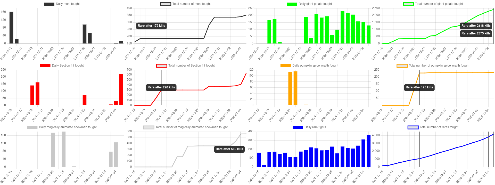

A little tool for analyzing Crimbo 2024 session logs.

**Not** designed to work for anybody else but me, bearsdotzone, and may be buggy.

If you want to try regardless, in .env set `SESSIONPATH` to your KolMafia sessions directory and `USERNAME` to your
username.

Then `npm install` and `npm run dev`

For developers:

All the parsing logic takes place in `src/routes/+page.server.ts`. The webpage is defined in `src/routes/+page.svelte`
and is largely just chart.js wrangling.

